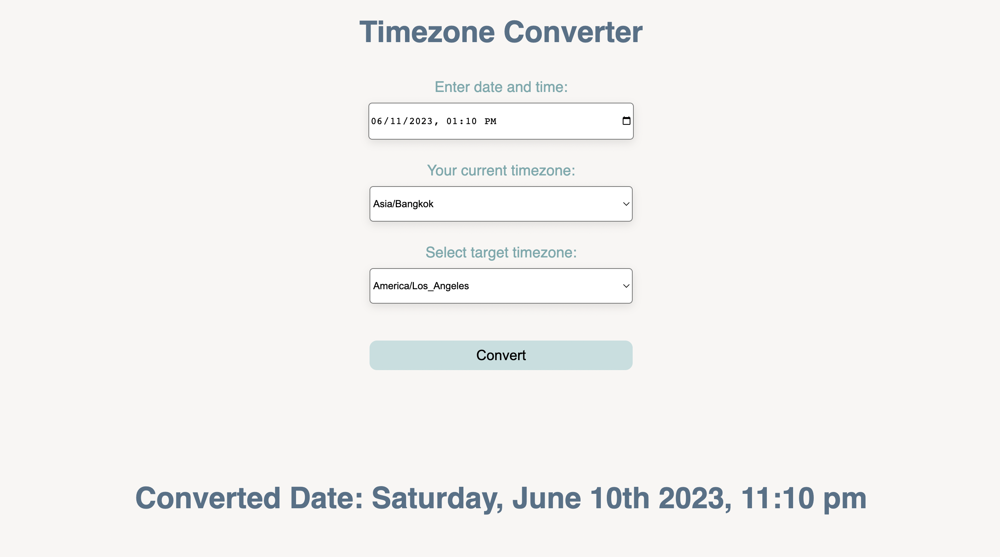

# Timezone Converter

This is a simple web application that allows you to convert dates and times between different timezones. By selecting your current timezone and the target timezone, you can convert a specific date and time to the equivalent time in the target timezone.

## How to Use

1. Open the `index.html` file in a web browser.

2. The application interface will be displayed, showing a form with the following fields:

   - **Enter date and time**: Input field where you can enter the date and time you want to convert. The format for the date and time is based on the browser's locale settings.

   - **Your current timezone**: Dropdown list where you can select your current timezone from the available options.

   - **Select target timezone**: Dropdown list where you can select the target timezone to which you want to convert the entered date and time.

3. After filling in the required fields, click the "Convert" button or press Enter to initiate the conversion process.

4. The result of the conversion will be displayed in the designated area below the form. The converted date and time in the target timezone will be shown.

## Dependencies

This application relies on the following external libraries:

- [Moment.js](https://momentjs.com/): A JavaScript library for parsing, validating, manipulating, and displaying dates and times.

- [Moment Timezone](https://momentjs.com/timezone/): A Moment.js add-on that enables timezone support, allowing conversion and manipulation of dates and times across different timezones.

These libraries are included in the application using external CDN links, so an internet connection is required for the application to function properly.

## Customization

You can customize the available timezones in the dropdown lists by modifying the `<option>` elements in the HTML code. Add or remove options as needed, following the provided format.

Additionally, you can modify the styles of the application by editing the `styles.css` file.

## Credits

This application was developed by [Your Name] and is provided as an open-source project. Feel free to use and modify the code according to your needs.

Please note that the timezone conversions may not account for daylight saving time changes, historical timezone differences, or other complex timezone scenarios. Use this application as a general tool and refer to authoritative sources for accurate and up-to-date timezone information.
